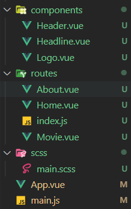
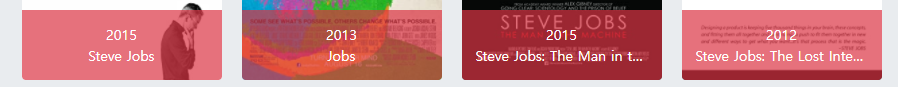

# f1. 프로젝트 생성

## 1.1 npm 프로젝트 생성

```bash
npm init -y
```

<br>

## 1.2 패키지 설치

### 1.2.1 Webpack 설치

> ```bash
> npm init -y
> npm i -D webpack webpack-cli webpack-dev-server@next copy-webpack-plugin html-webpack-plugin
> ```
>
> - webpack : 패키지 번들러 동작을 위한 패키지
> - webpack-cli : 웹팩을 사용하여 프로젝트를 진행할 떄 생산성을 높이기 위해서 사용한다. webpack configuration을 설정하는데 도움을 주는 도구들을 제공. Commend line interface를 사용할 수 있게 한다.
> - webpack-dev-server : 개발환경에서만 사용되며, 개발과정에서 코드를 실시간으로 서버에 적용하기 위해서 사용한다.
> - html-webpack-plugin : 최초 실행될 HTML 템플릿 연결
> - copy-webpack-plugin : 정적 파일 복사

> ### webpack.config.js 설정
>
> ```js
> //webpack.config.js
> 
> const path = require('path')
> 
> module.exports = {
>   entry: './src/main.js',
>   output: {
>     path: path.resolve(__dirname, 'dist'),
>     filename: 'main.js',
>     clean: true // 기존 내용을 제거
>   },
> }
> ```
>
> ### entry
>
> 웹팩에서 사용할 진입점 파일을 지정해주는 것으로 기본 값은 `./src/index.js`지만, 설정을 통해 **여러 개 혹은 다른 것**을 지정할 수 있다. (웹팩은 기본적으로 자바스크립트 파일을 진입점으로 사용한다.)
>
> ### output
>
> entry에 입력된 파일들을 분석해서 웹팩이 결과물(생성된 번들)을 지정하는 설정이다. 기본 출력 파일은 `./dist/main.js` 이고 다른 파일들은 `./dist`파일로 설정된다.
>
> ### path
>
> path 속성은 절대 경로를 필요로 하기 때문에 해당 경로를 명시해주어야 한다. node.js 에서 사용할 수 있는 `require`라는 전역함수를 이용해서 `webpack.config.js`파일이 있는 디렉터리(__dirname)에 `dist`라는 폴더를 생성한 뒤 해당 폴더에 번들(filename으로) 반환한다.
>
> ### loder
>
> ```bash
> npm i -D postcss sass autoprefixeㄱ
> npm i -D css-loader file-loader postcss-loader sass-loader style-loader
> ```
>
> - sass: SCSS(Sass) 문법을 해석
> - postcss: Autoprefixer 등의 다양한 스타일 후처리기 패키지
> - autoprefixer: 스타일에 자동으로 공급 업체 접두사(Vendor prefix)를 적용하는 PostCSS의 플러그인
> - sass-loader: SCSS(Sass) 파일을 로드
> - postcss-loader: PostCSS(Autoprefixer)로 스타일 파일을 처리
> - css-loader: CSS 파일을 로드
> - file-loader: 지정된 파일(이미지)을 로드
> - style-loader: 로드된 스타일(CSS)을 `<style>`로 `<head>`에 삽입
>
> 웹팩은 모든 파일을 모듈로 취급한다. css, scss, img 등을 모두 모듈로 취급하기 때문에 js코드에서 직접 import가 가능한데 이것이 로더의 역할이다.
>
> 로더의 적용 순서는 기본적으로 오른쪽에서 왼쪽이다. `,`단위로 개행해서 입력하면 아래에서 위로 순차적으로 적용된다.
>
> ```js
> //webpack.config.js
> 
> module: {
>  //생략
>     rules: [
>       {
>         test: /\.s?css$/,
>         use: [
>           'style-loader',
>           'css-loader',
>           'postcss-loader',
>           'sass-loader'
>         ]
>       }, 
>       {
>         test: /\.(png|jpe?g|gif|webp)$/,
>         use: 'file-loader'
>       },
>   ]
>   },
> //생략
> }
> ```
>
> ```js
> //.postcssrc.js
> module.exports = {
>   plugins: [
>     require('autoprefixer')
>   ]
> }
> ```
>
> 
>
> ### plugin
>
> ```bash
> npm i -D html-webpack-plugin
> ```
>
> entry의 js파일을 loader를 이용해 웹팩이 만든 번들에 추가적인 작업을 하기 위한 것으로 결과물의 형태를 바꾸는 역할을 한다.

<br>

### 1.2.2 babel 설치

> 최신의 자바스크립트 문법(ES6 이상)을 브라우저가 이해할 수 있도록 ES5로 변환해주는 자바스크립트 컴파일러
>
> ```bash
> npm i -D @babel/core @babel/plugin-transform-runtime @babel/preset-env babel-loader
> ```
>
> - @babel/core: ES6 이상의 코드를 ES5 이하 버전으로 변환
> - @babel/preset-env: Babel 지원 스펙을 지정
> - @babel/plugin-transform-runtime: Async/Await 문법 지원
> - babel-loader: JS 파일을 로드
>
> ### .babelrc.js  설정
>
> ```js
> module.exports = {
>   presets: ['@babel/preset-env'],
>   plugins: [
>     ['@babel/plugin-transform-runtime']
>   ]
> }
> ```
>
> ### loader 추가
>
> ```js
> //webpack.config.js
> module.exports = {
> // 생략
>   module: {
>     rules: [
>       {
>         test: /\.js$/,
>         exclude: /node_modules/, // 제외할 경로
>         use: [
>           'babel-loader'
>         ]
>       },
>     ]
>   }
> // 생략
> }
> ```

<br>

### 1.2.3 vue 설치

> ### vue 설치
>
> ```bash
> npm i -D vue@next
> ```
>
> ### 패키지 설치
>
> ```bash
> npm i -D vue-loader@next vue-style-loader @vue/compiler-sfc
> ```
>
> ### webpack.config.js 설정
>
> ```js
> //webpack.config.js
> // 생략
> const { VueLoaderPlugin } = _require('vue-loader')
> 
> module.exports = {
> //생략
>   module: {
>   //생략
>     rules: [
>       {
>         test: /\.vue$/,
>         use: 'vue-loader'
>       },
>       {
>         test: /\.s?css$/,
>         use: [
>           'vue-style-loader',
>         ]
>       },
>     ]
>     //생략
>   },
> 
>   plugin: [
> //생략
>     new VueLoaderPlugin()
>   ],
> }
> ```

### 1.2.4 eslint

> ```bash
> npm i -D eslint eslint-plugin-vue babel-eslint
> ```
>
> ### .eslintrc.js 설정
>
> ```js
> // .eslintrc.js
> module.exports = {
>   env: {
>     browser: true,
>     node: true
>   },
>   extends: [
>     // 'plugin:vue/vue3-essential', // Lv1
>     'plugin:vue/vue3-strongly-recommended', // Lv2
>     // 'plugin:vue/vue3-recommended', // Lv3
>     'eslint:recommended'
>   ],
>   parserOptions: {
>     parser: 'babel-eslint'
>   },
>   rules: {
>     'vue/html-self-closing': ['error', {
>       html: {
>         void: 'always',
>         normal: 'never',
>         component: 'always'
>       },
>       svg: 'always',
>       math: 'always'
>     }],
>     'vue/html-closing-bracket-newline': ['error', {
>       singleline: 'never',
>       multiline: 'never'
>     }]
>   }
> }
> ```

<br>

### 1.2.5 기타 설정 및 webpack.config.js 최종

> ```js
> const _require = id => require(require.resolve(id, {
>   paths: [require.main.path]
> }))
> const path = _require('path')
> const HtmlPlugin = _require('html-webpack-plugin')
> const CopyPlugin = _require('copy-webpack-plugin')
> const {
>   VueLoaderPlugin
> } = _require('vue-loader')
> 
> module.exports = {
>   resolve: {
>     extensions: ['.js', '.vue'],
>     alias: {
>       '~': path.resolve(__dirname, 'src'),
>       'assets': path.resolve(__dirname, 'src/assets')
>     }
>   },
> 
>   entry: './src/main.js',
> 
>   output: {
>     path: path.resolve(__dirname, 'dist'),
>     filename: 'main.js',
>     clean: true
>   },
> 
>   module: {
>     rules: [{
>         test: /\.vue$/,
>         use: 'vue-loader'
>       },
>       {
>         test: /\.s?css$/,
>         use: [
>           'vue-style-loader',
>           'style-loader',
>           'css-loader',
>           'postcss-loader',
>           'sass-loader'
>         ]
>       },
>       {
>         test: /\.js$/,
>         exclude: /node_modules/,
>         use: [
>           'babel-loader'
>         ]
>       },
>       {
>         test: /\.(png|jpe?g|gif|webp)$/,
>         use: 'file-loader'
>       }
>     ]
>   },
> 
>   plugins: [
>     new HtmlPlugin({
>       template: './index.html'
>     }),
>     new CopyPlugin({
>       patterns: [{
>         from: 'static'
>       }]
>     }),
>     new VueLoaderPlugin()
>   ],
> 
>   devServer: {
>     host: 'localhost',
>     port: 8080,
>     hot: true
>   }
> }
> ```
>
> ### 브라우저 지원 설정
>
> ```json
> //package.json
> 
>   "__browserslist": "이 프로젝트가 지원하는 대상 브라우저를 지정 for Autoprefixer!",
>   "browserslist": [
>     "> 1%",
>     "last 2 versions"
>   ],
> ```

---

# 2. Header

## 2.1 Vue-router

### 2.3.1 설치

> ```bash
> npm install vue-router@4
> ```

### 2.3.2 router-link (RouterLink)

> ``a``태그 대신해서 링크 연결을 제공하는 Vue-router의 태그. 실질적으로는 ``a``태그로 변환되어 출력된다.
>
> ### active-class 속성
>
> 활성화 되고 있는 ``a``태그에 남기는 속성으로 ``router-link-active``을 기본값으로 한다. 클래스를 이용해서 스타일을 적용시키는 부트스트랩을 이용할 경우 값을 바꿔서 사용해야 한다.
>
> ```vue
> <RouterLink
> 	:to="nav.href" 
> 	active-class="active" // 값을 바꾸었다.
> 	class="nav-link">
> 	{{ nav.name }}
> </RouterLink>
> ```
>
> ### components 와 routes
>
> 
>
> 프로젝트에서 Vue 파일이 들어있는 폴더의 구조가 위와 같이 구성되어 있다. **components**는 개별적인 기능?이라고 할 수 있다. 레고 블록을 조립해서 완성품을 만들 듯, 컴포넌트가 모여서 페이지가 완성된다. **routes**는 페이지에 해당한다. 즉, **routes 폴더 안에 있는 특정 Vue 파일에 컴포넌트에 해당하는 Vue파일이 쌓여서 페이지를 장식**한다.
>
> <br>
>
> ```js
> //main.js
> import {
>   createApp
> } from 'vue'
> import App from './App.vue'
> import router from './routes/index.js'
> 
> createApp(App)
>   .use(router)
>   .mount('#app')
> ```
>
> main.js 에서 어떤 파일들을 vue routing하는데 사용할지 설정하고
>
> ```js
> // routes/index.js
> import {
>   createRouter,
>   createWebHashHistory
> } from "vue-router";
> import Home from './Home'
> import About from './About'
> import Movie from './Movie'
> 
> export default createRouter({
>   history: createWebHashHistory(),
>   // 웹사이트 페이지 구분
>   routes: [{
>       path: '/',
>       component: Home
>     },
>     {
>       path: '/about',
>       component: About
>     },
>     {
>       path: '/movie',
>       component: Movie
>     }
>   ]
> })
> ```
>
> index.js에 해당 정보를 저장해두었다. Home, About, Movie에 해당하는 Vue 파일들이 route되는 페이지에 해당한다.

<br>

## 2.2 v-model

> ```vue
> <template>
>   <h1> {{ msg }} </h1>
>   <input
>   	type="text"
>   	:value="msg" />
> </template>
> 
> <script>
> export default {
>   data(){
>     return {
>       msg: 'Hello'
>     }
>   }
> }
> ```
>
> ``msg``라는 데이터를 ``input`` 태그와 ``h1``태그의 데이터로 사용하고 있다. 이는 단방향 데이터 바인딩에 해당한다. 브라우저에서 ``input``요소를 통해 데이터를 수정하여도 데이터가 갱신되지 않는다.
>
> ```vue
> <template>
>   <h1> {{ msg }} </h1>
>   <input
>   	type="text"
>   	:value="msg" 
>   	@input="change"/>
> </template>
> 
> <script>
> export default {
>   data(){
>     return {
>       msg: 'Hello'
>     }
>   },
>   methods: {
>     change(e) {
>       console.log(e.target)
>       this.msg = e.target.value
>     }
>   }
> }
> ```
>
> ``change``라는 메서드를 이용해서 ``input``요소의 데이터 변화를 ``msg``에도 할당해준다. 즉 script 안의 ``msg``라는 데이터가 ``input``태그와 ``h1``태그에 영향을 주고,  브라우저에서 ``input``요소를 통한 데이터 변화가 ``change``메서드를 통해 script 내부의 ``msg``데이터에도 영향을 주게 된다. -> 양방향 데이터 바인딩
>
> <br>
>
> Vue.js에서는 이러한 양방향 데이터 바인딩을 손 쉽게 이용할 수 있는 방법을 제공한다.
>
> ### in-line 방식
>
> ```vue
> <template>
>   <h1> {{ msg }} </h1>
>   <input
>   	type="text"
>   	:value="msg" 
>   	@input="msg = &event.target.value"/>
> </template>
> 
> <script>
> export default {
>   data(){
>     return {
>       msg: 'Hello'
>     }
>   }
> }
> ```
>
> ### v-model
>
> ```vue
> <template>
>   <h1> {{ msg }} </h1>
>   <input
>   	type="text"
>   	v-model="msg" />
> </template>
> 
> <script>
> export default {
>   data(){
>     return {
>       msg: 'Hello'
>     }
>   }
> }
> ```

<br>

# 3. Search bar

## 3.1 상태관리 - Store

``props``나 ``project/inject``를 이용해서 컴포넌트 간 데이터 공유가 가능하지만 프로젝트가 거대해질 수록 코드가 복잡해지고 유지보수가 어렵다. 이런 점을 해결하기 위해서 Vuex라는 상태관리 패턴 라이브러리를 사용할 수 있다. Vuex에서 사용하는 패턴인  Store는 여러 모듈을 이용해 데이터를 관리하여 모든 컴포넌트에서 쉽게 데이터를 사용할 수 있다.

### 3.1.1 Store 초기 설정

> ### Store 기본 구성하기
>
> ```js
> import {
>   createStore
> } from 'vuex'
> import movie from './movie'
> import about from './about'
> export default createStore({
>   modules: {
>     movie,
>     about
>   }
> })
> ```
>
> Store의 기본 구성을 설정한 코드이다. Store의 내부에서도 모듈을 이용해서 데이터를 관리할 수 있는데, 위 코드에서는 ``movie``와 ``about``이라는 모듈을 이용해서 프로젝트에서 사용할 데이터를 관리한다. 이렇게 Store의 기본 구성을 마치고 나면
>
> ```js
> import {
>   createApp
> } from 'vue'
> // ...
> import store from './store/index.js'
> createApp(App)
>   .use(router)
>   .use(store)
>   .mount('#app')
> ```
>
> Store의 기본 구성 JS파일을 import 해주고 ``use``메서드를 이용해서 사용함을 명시해준다.

### 3.1.2 Store 모듈의 속성

> - namespaced : Store 내부에서 모듈로 사용할 수 있는지 여부. true / false
> - state : 컴포넌트의 script에서 data와 대응하는 것으로 볼 수 있다. 즉, 데이터(vuex에서는 상태)를 의미. **함수 이용해서 객체 데이터를 반환해줘야 한다.**
> - getters : computed 속성처럼 **상태(state)를 활용해서** 계산된 데이터를 만드는 속성. state 매개변수를 받아서 state의 데이터를 사용한다고 따로 명시를 해줘야 한다.
>
> ```js
> //example
> //...
> getters: {
>     [이름](state) {
>         return state.[데이터].([메서드])
>     }
> }
> ```
>
> - mutations : 메서드처럼 활용 가능. mutations에서만 데이터를 변경할 수 있다. **(다른 속성에서 데이터를 수정할 수 없다.)**
>
> ```js
> //example
> //...
> mutations: {
>     [이름](state) {
>         state.[데이터] = [원하는 데이터로 변경]
>     }
> }
> ```
>
> - actions : 메서드처럼 활용 가능. 하지만 mutations처럼 데이터를 수정할 수 없다. 비동기로 데이터를 처리하도록 구성이 되어 있다.
>
> ```js
> actions: {
>     [이름](context, (매개변ㅅ)) {
>     	// state를 직접 활용할 수 없고, context라는 객체 데이터를 이용한다.
>     	// context는 state 뿐만 아니라, getters와 mutations를 활용하기 위한 commit을 제공한다.
>         context[속성] = [변경 내용]
>     }
> }
> ```

<br>

## 3.2  동기 / 비동기

> [정리글](https://velog.io/@main_string/JS-Promise)

<br>

## 3.3  자동 줄바꿈으로 인한 영역 확대 방지

```css
.info {
    background-color: rgba($red, 0.7);
    width: 100%;
    padding: 14px;
    font-size: 14px;
    text-align: center;
    position: absolute;
    left: 0px;
    bottom: 0px;
  }
```


텍스트가 길어져서 줄바꿈으로 인해 정해놓은 영역이 커졌다.

```css
    white-space: nowrap;
    overflow: hidden;
    text-overflow: ellipsis;
```

[white-space mdn](https://developer.mozilla.org/ko/docs/Web/CSS/white-space)

[text-overflow mdn](https://developer.mozilla.org/en-US/docs/Web/CSS/text-overflow)



위의 세 속성을 조합하여 줄바꿈 방지, 넘치는 부분 숨김 처리를 할 수 있다.

<br>

## 3.4 마우스 올리면 테두리 표시하기

```scss
&:hover::after {
    content: "";
    position: absolute;
    top: 0;
    bottom: 0;
    left: 0;
    right: 0;
    border: 6px solid $primary;
```

before와 after 모두 동일안 결과를 얻을 수 있다. absolute를 사용하기 때문에 부모요소 위로 표기되기 때문이다.

마우스를 올렸을 때만  after로 요소 뒤에 새로운  요소가 생성되기 때문에 애니메이션을 적용시키기 위해서 다음과 같이 코드를 수정했다.

```css
  .after {
    opacity: 0;
    z-index: 1;
    position: absolute;
    top: 0;
    bottom: 0;
    left: 0;
    right: 0;
    border: 6px solid $primary;
    transition: opacity 0.25s;
    &:hover {
      opacity: 1;
    }
```

# 4. Plugin 만들어 적용하기

## 4.1 Plugin 생성

```js
//src/pulgins/loadImage.js

export default {
  install(app) {
    app.config.globalProperties.$loadImage = src => {
      return new Promise(resolve => {
        const img = document.createElement('img')
        img.src = src
        img.addEventListener('load', () => {
          resolve()
        })
      })
    }
  }
}
```

## 4.2 Plugin 등록

```js
//src/main.js
/...
createApp(App)
  .use(router)
  .use(store)
  .use(install) // 등록
  .mount('#app')
```

## 4.3 사용 예

```vue
methods: {
    async init() {
        await this.$loadImage(this.movie.Poster);
        this.imageLoading = false;
    },
},
```

